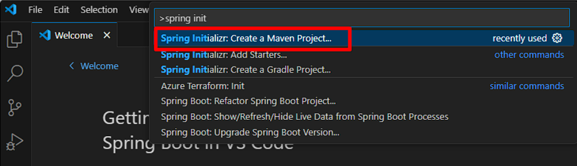

# Creación de un Proyecto en Spring Boot con Maven y Java 22

Este documento tiene como objetivo guiar a los estudiantes de programación en la creación de un proyecto desde cero utilizando Spring Boot, Maven y Java 22. A través de pasos claros y concisos, los estudiantes aprenderán a configurar su entorno de desarrollo y a implementar un API simple llamado HelloWorldController, que incluirá un método GET llamado `sayHi`.

##  Pasos para Crear el Proyecto

### 1. Configuración del Entorno
Antes de comenzar, asegúrate de tener instalado lo siguiente:
* **Java 22**: Verifica que Java esté instalado ejecutando java -version en la terminal.

## 2. Crear un Nuevo Proyecto Maven con Visual Studio Code

**Paso a paso para iniciar un nuevo proyecto Spring Boot con Maven en Visual Studio Code:**

1. **Abre Visual Studio Code** y asegúrate de tener instalada la extensión **Java Extension Pack**.
2. **Abre la Paleta de Comandos:**
   * **Windows/Linux:** Ctrl+Shift+P
   * **macOS:** Cmd+Shift+P
3. **Busca y selecciona:** "Spring Initializr: Create a Spring Boot Project".
4. **Configura tu proyecto:**
   * **Spring Boot version:** Selecciona la versión deseada.
   * **Project Metadata:**
     * **Group:** Define el identificador del grupo (por ejemplo, `com.tuempresa`).
     * **Artifact:** Especifica el nombre del artefacto (por ejemplo, `mi-proyecto`).
     * **Name:** El nombre que se mostrará en el proyecto.
     * **Description:** Una breve descripción del proyecto.
     * **Package name:** El paquete base para tus clases.
   * **Dependencies:** 
     * **Spring Web:** Para desarrollar aplicaciones web.
     * **Spring DevTools:** Para facilitar el desarrollo, con recarga en caliente, etc.
   * **Packaging:** Selecciona `Jar` para crear un archivo ejecutable.
   * **Java version:** Elige la versión de Java instalada en tu sistema.
   * **Build system:** Maven
5. **Selecciona la carpeta de destino** donde se creará el proyecto.
6. **Da clic en Finalizar**.

**Estructura básica del proyecto:**
Una vez creado el proyecto, encontrarás la siguiente estructura básica:
* **pom.xml:** El archivo de configuración de Maven, donde se definen las dependencias, plugins, etc.
* **src/main/java:** Contiene el código fuente de tu aplicación.
* **src/test/java:** Para las pruebas unitarias.
* **src/main/resources:** Para archivos de configuración, plantillas, etc.

